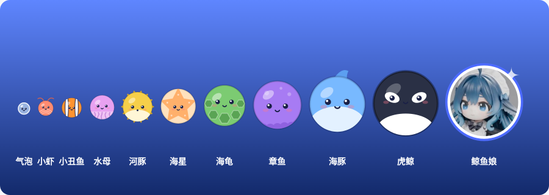
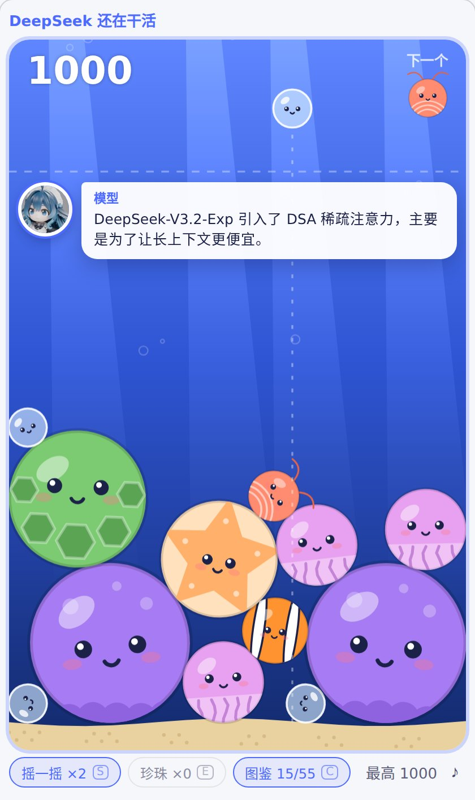
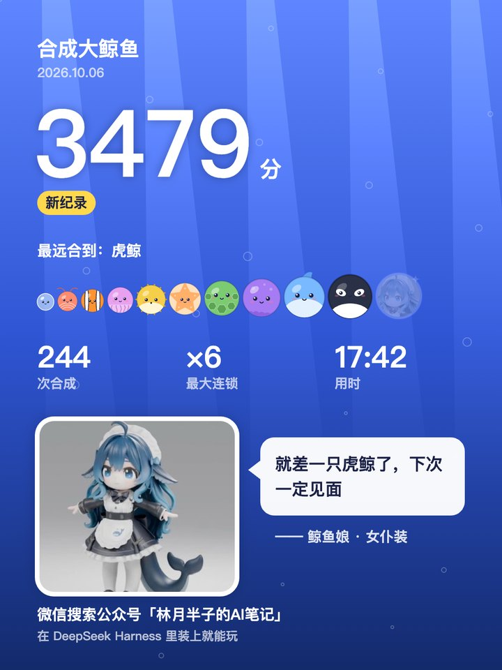
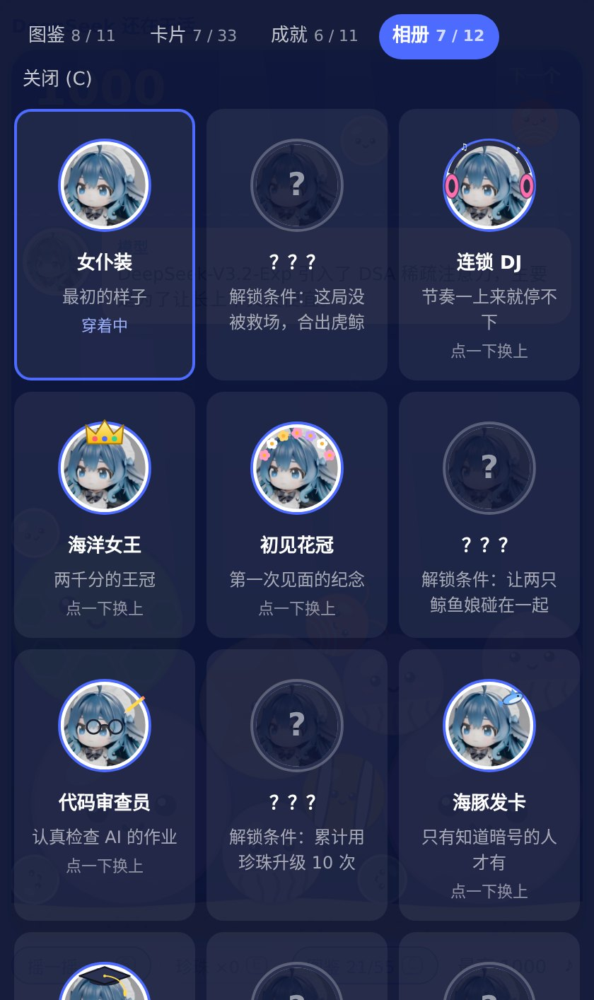
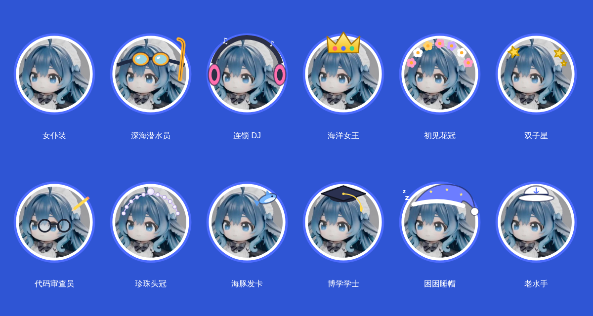

<p align="center">
  
</p>

<h1 align="center">合成大鲸鱼</h1>

<p align="center">
  <b>等 DeepSeek 干活的时候，合一只鲸鱼娘。</b><br>
  一个 DeepSeek Harness 原生插件：合成大西瓜的玩法，海洋生物版，终点是鲸鱼娘。
</p>

<p align="center">
  
  
  
  
</p>

<table align="center">
  <tr>
    <td align="center" width="33%"></td>
    <td align="center" width="33%"></td>
    <td align="center" width="33%"></td>
  </tr>
  <tr>
    <td align="center">鲸鱼娘陪你玩，顺便念知识卡片</td>
    <td align="center">一局结束，生成分享卡</td>
    <td align="center">解锁成就，给鲸鱼娘换造型</td>
  </tr>
</table>

## 安装

需要 DeepSeek Harness 0.2 或更新（桌面端或 `dsh web`）。

在 DSH 侧栏点 **插件 → 添加插件**，填入下面这行，点 **安装**，再点 **立即启用**：

```
github:lqshow/dsh-whale-merge
```

装好不用重启。右侧边栏「开始」里会多出 **合成大鲸鱼**；DeepSeek 一轮干了 5 秒还没完，输入框上方也会冒出「合一把」的提示。

## 怎么玩

两只一样的海洋生物碰在一起，合成更大的一只。有东西在警戒线上方停留超过 3 秒，这局结束。

| 操作 | 鼠标 | 键盘 |
| --- | --- | --- |
| 对准 | 移动鼠标 | ← → 或 A / D |
| 放下 | 点击画面 | 空格 |
| 摇一摇（每局 2 次） | 点「摇一摇」 | S |
| 用珍珠 | 点「珍珠」 | E |
| 打开图鉴 | 点「图鉴」 | C |
| 再来一局 | 点按钮 | R |

按键前先点一下游戏画面。焦点在游戏里时，按键不会跑进 DeepSeek 的输入框。

它是回合制的：丢一只，切回去看一眼 DeepSeek 的输出，回来接着丢。切走标签页，物理会暂停，这局还在。

## 亮点

**🐋 鲸鱼娘陪你玩**
她会从画面左边游进来说话：连锁合成、第一次合出大家伙、快满出来了、你发呆太久、DeepSeek 干完了，她都会出声。合成出水母或更大的生物时，她还会念一张 AI 知识卡片，一共 33 张。

**📝 交作业奖励**
DeepSeek 一轮跑超过 8 秒、干完后，鲸鱼娘会提醒你去检查。离开游戏去看一眼（至少 3 秒）再回来，就送你珍珠：跑满 1 分钟送 2 颗，满 3 分钟送 3 颗。游戏想鼓励的，是你认真看 AI 的产出。

**🦪 道具**
- **珍珠**：碰到谁，谁就升一级；碰到鲸鱼娘 +50。最多攒 9 颗，跨局保留
- **摇一摇**：整个罐子晃一下，把卡住的震开，晃的时候警戒线暂停判定
- **鲸鱼娘救场**：快溢出来时，她把场上所有气泡和小虾收走，每局一次

**✨ 手感**
合成时飘出得分（连锁金色、珍珠粉色），合出章鱼以上画面会震一下。连锁：放下一只之后接连触发的合成，从第二下开始每下额外 +3。系统开了「减少动态效果」时不震屏。

**🖼️ 结算分享卡**
一局结束点「生成分享卡」，得到一张 1080×1440 的竖图，可以直接复制或保存。底部署名在 `src/share.ts` 的 `SHARE_BRAND` 里改。

## 收集：图鉴、卡片、成就、相册

按 C 或点「图鉴」打开收集面板，打开时游戏暂停。

- **图鉴**：11 种海洋生物，第一次合出来就永久点亮，没发现的是剪影
- **卡片**：鲸鱼娘念过的知识卡片都收在这里，可以翻着看
- **成就**：11 个成就，每个解锁一套鲸鱼娘造型
- **相册**：12 套造型，点一下换上。换上的造型会出现在游戏里的鲸鱼娘身上，也会印在分享卡上

<p align="center">
  
</p>

| 成就 | 条件 | 解锁造型 |
| --- | --- | --- |
| 初次见面 | 合出鲸鱼娘 | 初见花冠 |
| 独自下潜 | 这局没被救场，合出虎鲸 | 深海潜水员 |
| 连锁反应 | 一次放下引发连锁 ×4 | 连锁 DJ |
| 两千分 | 单局 2000 分 | 海洋女王 |
| 双鲸同游 | 让两只鲸鱼娘碰在一起 | 双子星 |
| 认真验收 | 领到一次交作业奖励 | 代码审查员 |
| 珍珠串 | 累计用珍珠升级 10 次 | 珍珠头冠 |
| 知道暗号 | 找到隐藏的暗号 | 海豚发卡 |
| 博览群书 | 看完全部 33 张知识卡片 | 博学学士 |
| 陪你等 | 累计玩满 30 分钟 | 困困睡帽 |
| 十次出海 | 玩满 10 局 | 老水手 |

造型现在是在头像上画的头饰。想换成真正的造型图，看 [`docs/outfit-prompts.md`](docs/outfit-prompts.md)，里面有每套的生图提示词和放图方法。

> **彩蛋**：游戏里藏了一个暗号。点一下游戏画面，用键盘打出它，手上这一只会变成海豚。提示：跟你每天在用的那个模型有关。

## 为什么是原生插件，不是 Claude Code Mod

DSH v0.2.1-alpha.1 加了实验性的 Claude Code Mods 兼容层，但现阶段它只能在输入框上方画一条文字横幅：没有面板，画不了图，也收不到按键。所以这个游戏直接用 DSH 自己「一切皆插件」的插件体系，挂了三个点：

| 挂载点 | 用来干什么 |
| --- | --- |
| `sidebarRightTabs.register` + `sidebar.right.pane.tab` 插槽 | 右侧边栏的游戏标签页 |
| `conversation.input.dock` 插槽 | 输入框上方的「合一把」提示条 |
| `remote.$on('api-session/status')` | 知道 DeepSeek 什么时候开始、什么时候干完 |

## 开发

```bash
npm install
npm test             # 物理模拟：自动玩几局，检查合成、计分、道具和结束判定
npm run preview      # 生成本地预览页，浏览器打开 dev/preview.html 就能玩（不需要 DSH）
npm run build        # 生成 client.js
```

> ⚠️ 从 GitHub 安装时 DSH 不会运行构建。改完代码记得 `npm run build`，把 `client.js` 一起提交。

<details>
<summary><b>本地预览页的几个模式</b></summary>

- `dev/preview.html`：玩游戏，左边有按钮模拟「DeepSeek 开始干活 / 干完了」
- `dev/preview.html#gallery`：合成链全家福（就是本页顶部那张）
- `dev/preview.html#final`：开局直接放两只虎鲸，看合成鲸鱼娘的效果

想看交作业奖励：点左边「模拟：DeepSeek 跑了 90 秒后干完」（这一下就算离开了游戏），等 3 秒再点回游戏画面。

</details>

<details>
<summary><b>代码地图</b></summary>

| 文件 | 内容 |
| --- | --- |
| `src/game.ts` | 游戏逻辑：matter-js 物理、合成、连锁、珍珠、摇一摇、警戒线。不碰 DOM，Node 里能跑 |
| `src/render.ts` | Canvas 画面：海底背景、十一种生物、水花、飘字、震屏 |
| `src/client.tsx` | DSH 浏览器端入口：面板、按键、提示条、交作业奖励、插件注册 |
| `src/talk.ts` | 鲸鱼娘的台词（中英） |
| `src/facts.ts` | 知识卡片 |
| `src/collection.ts`、`src/collection-ui.tsx` | 图鉴、卡片收藏、成就、相册 |
| `src/outfits.ts` | 12 套造型：头饰画法和造型图登记 |
| `src/share.ts` | 结算分享卡 |
| `src/sound.ts` | WebAudio 现场合成的音效 |
| `src/storage.ts` | 本地存档 |
| `index.js` | Host 端，什么也不做 |
| `cordis.patch.yml`、`locale/*.json`、`icon.svg` | DSH 组合包清单、插件名和图标 |
| `build.mjs` | 用 esbuild 打成 `window.__ModuleLoader__.load(...)` 格式的 `client.js`，React 由宿主提供 |

</details>

<details>
<summary><b>改玩法</b></summary>

| 想改什么 | 改哪里 |
| --- | --- |
| 合成链、半径、分数 | `src/game.ts` 的 `TIERS` |
| 掉落概率 | `src/game.ts` 的 `SPAWN_WEIGHTS` |
| 结束判定 | `src/game.ts` 的 `DEADLINE`、`DANGER_LIMIT_MS` |
| 知识卡片 | `src/facts.ts`，每条写清楚出处，日期和数字要能核对 |
| 台词 | `src/talk.ts`；说话时机和优先级在 `src/client.tsx` 的 `PRI` |
| 成就和造型 | `src/collection.ts`、`src/outfits.ts` |
| 鲸鱼娘形象 | 替换 `src/assets/` 里的两张图，再 `npm run build` |

</details>

## 隐私

不联网，不上传任何东西。最高分、图鉴、成就、珍珠都存在本机浏览器存储里。

## License

MIT © 林月半子 · 公众号「林月半子的AI笔记」
